# 한솔섬유 ERP System

## 목차
> ### SewingMES 
>>  [1. 개요](#1-개요-) &nbsp;
> [2. 시스템 구조](#2-시스템-구조) &nbsp;
> [3. 맡은 업무](#3-맡은-업무) &nbsp;
> [4. 개발 내역](#4-개발-내역)
> ### HR
>> [1. 개요](#1-개요--1) &nbsp;
> [2. 시스템 구조](#2-시스템-구조-) &nbsp;
> [3. 맡은 업무](#3-맡은-업무-) &nbsp;
> [4. 개발 내역](#4-개발-내역-1)

## SewingMES ✂️

---
### 1. 개요 
> 원단 입고 이후 봉제 완료에 이르기까지의 생산 흐름을  실시간으로 기록·관리하는 봉제 특화 MES

### 2. 시스템 구조
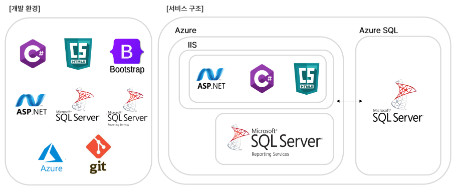
### 3. 맡은 업무 
> **원단 [입고, 검수, 이동, 재단]** 관련 기능 개발 및 유지보수 
### 4. 개발 내역
원단을 재단해 두 개의 원단을 만들 수도 있지만, 
봉제하기 위한 번들의 형태로도 만들 수 있다. 

|     프로젝트      |                                내용                                |        참고 화면        |
|:-------------:|:----------------------------------------------------------------:|:-------------------:|
|      분절       |             입고된 원단을 재단해 두 개의 원단 데이터로 활용할 수 있는 페이지 개발             |      [화면](#분절)      |
|      판갈이      |  검수 후, 번들 중 일부가 불량이 났을 경우 다른 번들 일부를 가져와 하나의 세트로 만들 수 있는 페이지 개발   |     [화면](#판갈이)      |
| 재단 후 이동 안한 원단 | 재단된 번들은 일반적으로 10일 이내 봉제 절차를 밟아야 하지만, 그렇지 못한 데이터를 확인할 수 있는 페이지 개발 | [화면](#재단-후-이동안한-원단) |
|  RackLayout   |           입고된 원단이 공장 내 어디 RACK에 위치해있는지 확인할 수 있는 페이지 개발           |  [화면](#RackLayout)  |
|    전체 작업량     |           입고, 이동, 재단, 검수, 봉제에 대한 작업량을 확인할 수 있는 페이지 개발            |    [화면](#전체-작업량)    |

## HR 😀

---

### 1. 개요 
> 임직원의 근태, 휴가, 복리후생 및 각종 사내 자원 이용을 통합적으로 관리하는 기업 인사 관리 시스템  
### 2. 시스템 구조 

### 3. 맡은 업무
> 기능 개발 및 유지보수
### 4. 개발 내역
|          프로젝트          |                 내용                 |             참고 화면              |
|:----------------------:|:----------------------------------:|:------------------------------:|
|        공용차량 신청         |   회사에서 운용하는 공용차량을 이용 신청하는 페이지 개발   |       [화면](#공용차량-신청-화면)        |
|      7층 교육실 이용 신청      |  회사 내 7층에 위치하는 교육실 이용 신청하는 페이지 개발  |     [화면](#7층-교육실-이용-신청-화면)     |
|  임직원 어린이집 위탁보육료 지원 신청  |     어린이집 위탁 보육료 지원금 신청 페이지 개발      | [화면](#임직원-어린이집-위탁보육료-지원-신청-화면) |
|     HR내 민감 정보 암호화      |     주민등록번호, 전화번호 등의 민감 정보 암호화      |                                |

## 참고 자료

### SewingMES
#### 분절
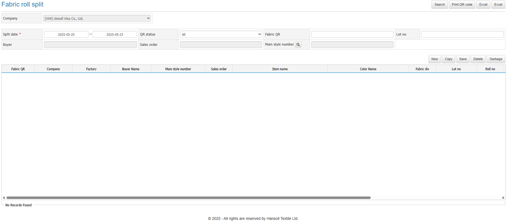

#### 판갈이
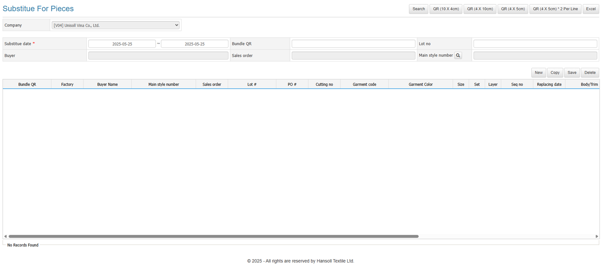

#### 재단 후 이동안한 원단
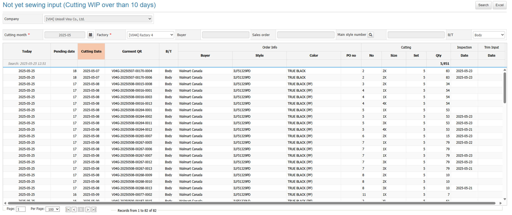
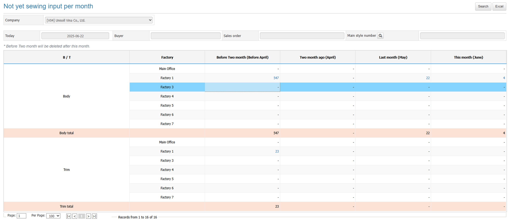
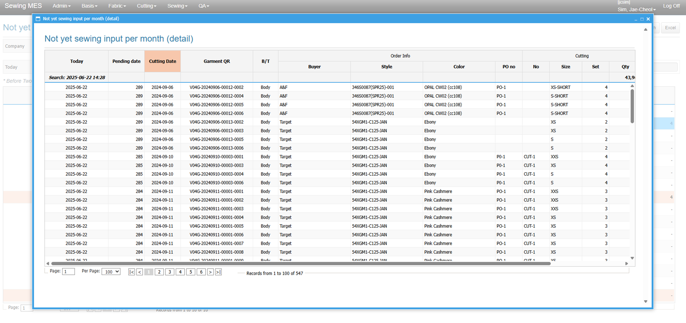

#### RackLayout
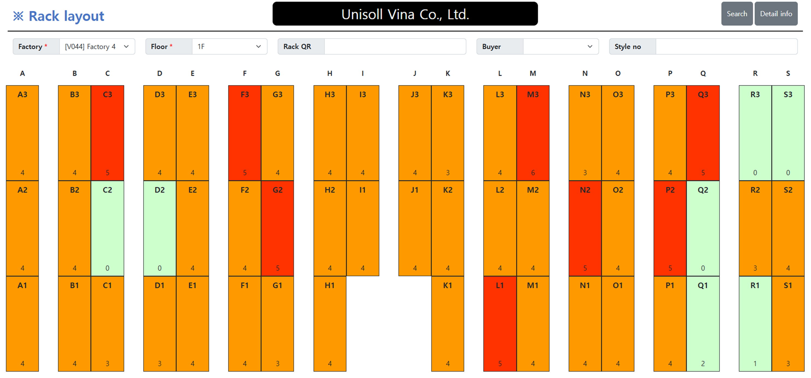

#### 전체 작업량
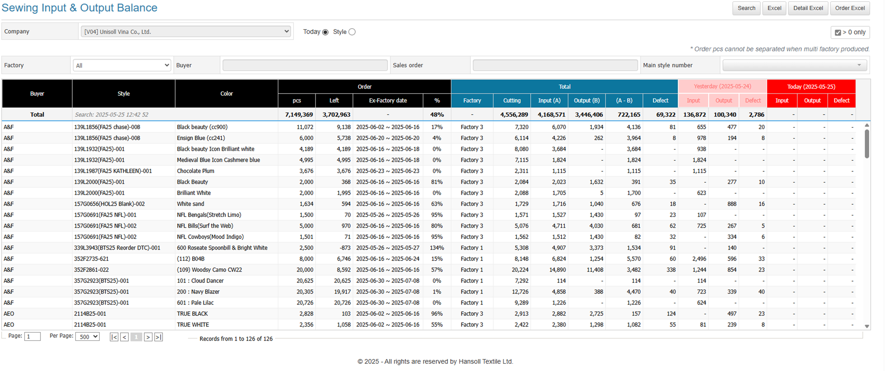

### HR
#### 공용차량 신청 화면
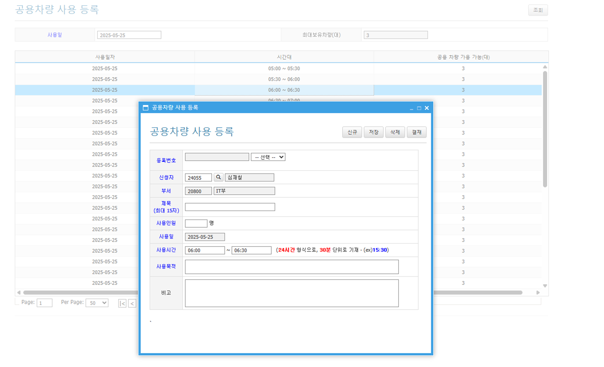

#### 7층 교육실 이용 신청 화면
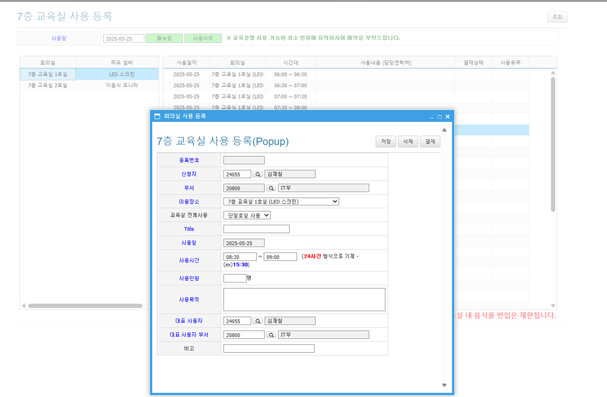

#### 임직원 어린이집 위탁보육료 지원 신청 화면
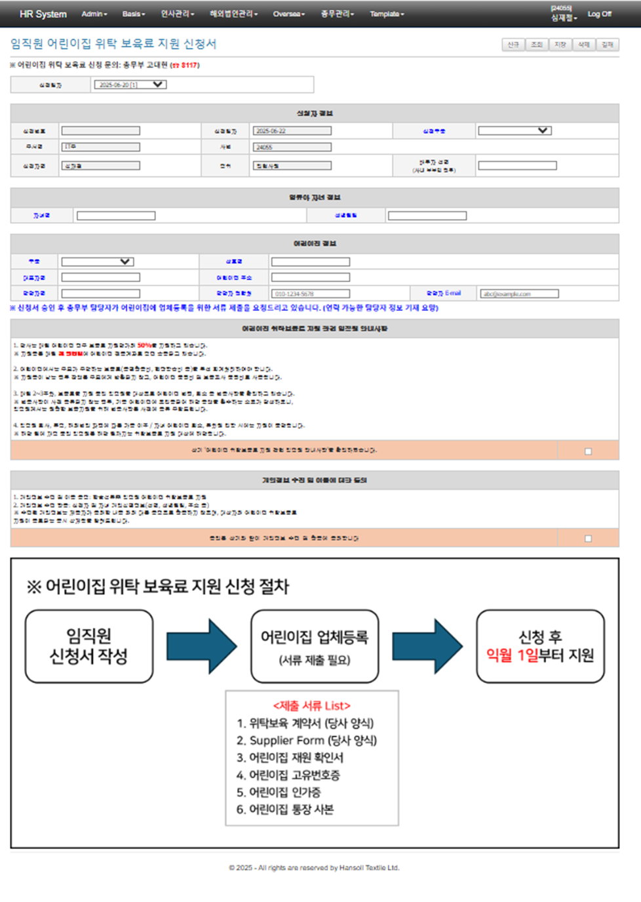
